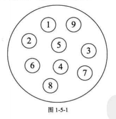
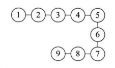
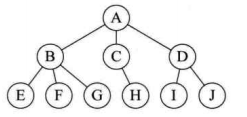
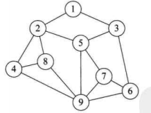
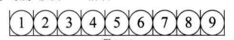
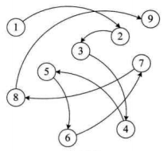

# 绪论

## 1.基本概念
- 数据

    > 描述客观事物的符号,是计算机中可以操作的对象,能被计算机识别,并输入给计算机处理的符号集合.

- 数据元素

    > 组成数据的,有一定意义的基本单位,在计算机中通常作为整体主力,也被成为记录.

- 数据项
    
    > 一个数据元素可以由若干个数据项组成
    > 数据项是数据不可分割的最小单位

- 数据对象
    
    > 是性质相同的数据元素的集合,是数据的子集

- 数据结构
    
    > 是相互之间存在一种或多种特定关系的数据元素的集合

## 2.结构分类
### 逻辑结构
1. 集合结构

    > 数据元素除了同属于一个集合外,无任何关系,类似数学中的集合 
     

2. 线性结构

    > 数据元素是一对一 
     

3. 树形结构

    > 数据元素是一对多,层次关系 
     

4. 图形结构

    > 数据元素是多对多 
     

### 物理结构
1. 顺序存储结构

    > 是把数据元素存放在地址连续的存储单元里,其数据间的逻辑关系和物理关系是一致的 
     

2. 链式存储结构

    > 是把数据元素存放在任务的存储单元里,这组存储单元可以是连续的,也可以是不连续的 
     

## 3.抽象数据类型
> 一个数学模型及定义在该模型上的一组操作,体现了程序设计中问题分解/抽象和信息隐藏的特性.