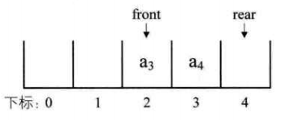
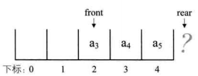
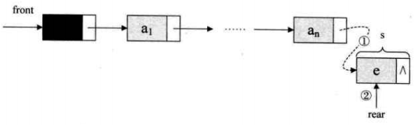
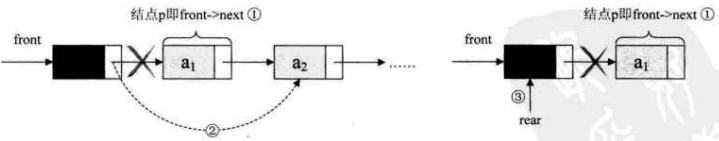

# 栈和队列

## 1. 栈
### 1.1 定义
    限定仅在表尾进行插入和删除操作的线性表
### 1.2 术语
    栈顶(top) : 允许插入和删除的一端
    栈底(bottom) : 另一端
    空栈 : 不含有任何数据元素
    LIFO结构 : 后进先出(Last In First Out)的线性表
    栈操作 : 进栈/压栈/入栈  出栈/弹栈
### 1.3 抽象数据类型
    初始化空栈
    入栈
    出栈
    判断栈是否为空
    返回栈顶元素
    返回栈的元素个数
    清空栈
### 1.4 存储结构
#### 1.4.1 顺序存储结构
    顺序栈
    进栈
        1.判断栈是否满
        2.栈顶指针加一
        3.将新元素插入栈顶空间
    出栈
        1.判断栈是否空
        2.将要删除的栈顶元素赋值给临时变量
        3.栈顶指针减一
    进栈和出栈的时间复杂度均为 O(1)
#### 1.4.2 链式存储结构
    链栈
    单链表的栈
        不需要头结点
        头指针和栈顶指针是同一个
    进栈
        1.创建新元素
        2.将栈顶指针赋值给新元素的后继
        3.新元素的地址赋值给栈顶指针
        4.元素个数加一
    出栈
        1.将栈顶节点复制给临时变量p
        2.使栈顶指针下移一位,指向后一节点
        3.释放节点p
        4.元素个数减一
### 1.5 应用
#### 1.5.1 递归
    定义
        直接调用自己或通过一系列的调用语句间接地调用自己的函数
    递归需要有停止条件
    斐波那契数列(Fibonacci)
        F0=0，F1=1，Fn=Fn-1+Fn-2（n>=2，n∈N*）
#### 1.5.2 中缀表达式
    即标准四则运算表达式
    中缀--->后缀
        从左到右遍历中缀表达式的每个数字和符号,若是数字就输出,即成为后缀表达式的一部分;
        若是符号,则判断其与栈顶符号的优先级,是右括号或优先级低于栈顶符号(乘除优先加减),
        则栈顶元素依次出栈并输出,并将当前符号进栈,一直到输出后缀表达式为止.
        栈用来进出运算的符号
#### 1.5.3 后缀表达式
    逆波兰表达式
        Reverse Polish Notation, RPN
    后缀--->中缀
        从左到右遍历表达式的每个数字和符号,遇到是数字就进栈,遇到是符号
        就将处于栈顶的两个数字出栈,进行计算,运算结果再进栈,直到最终结束
        栈用来进出运算的数字
## 2. 队列
### 2.1 定义
    只允许在一端进行插入操作,而在另一端进行删除操作的线性表
### 2.2 术语
    队头 : 允许删除的一端
    队尾 : 允许插入的一端
    FIFO : 先进先出(First In First Out)的线性表
### 2.3 抽象数据类型
    1.初始化空队列
    2.入队
    3.出队
    4.判断队列是否为空
    5.返回队头元素
    6.返回队尾元素
    7.清空队列
    8.返回队列的元素个数
### 2.4 存储结构
#### 2.4.1 顺序存储结构
入队 : 队尾追加元素,时间复杂度O(1) 
出队 : 队头删除元素,其他元素前移一位,时间复杂度O(n) 
假溢出 :  

#### 2.4.2 循环队列
    头尾相接的顺序存储结构,是顺序存储的改进方式
    队列空 : front == rear
    队列满 : (rear + 1) % QueueSize == front
    队列长度 : (rear - front + QueueSize) % QueueSize
#### 2.4.3 链式存储结构
链队列 
线性表单链表,只能头进尾出 
入队 :  
 
出队 : 

## 3. 总结
    栈与队列都是特殊的线性表
